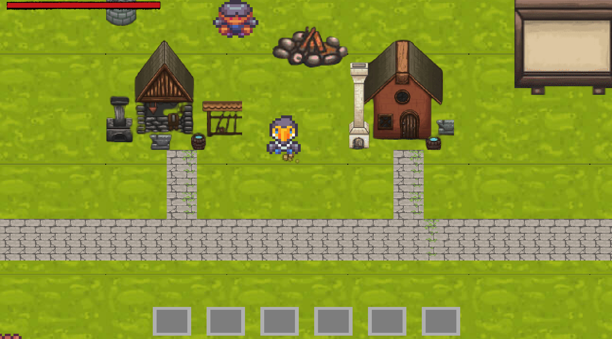

# RPG project :desktop_computer:

## Done by Melissa, Maxime and Romain - Epitech 2022 :mortar_board:

### Overview

This project is a part of the **first** year of Epitech. <br>
We had **1 month** to complete it. :spiral_calendar: <br>

The goal of this project was to create a **RPG game** in **C** with the **CSFML library**. :video_game:<br>

### Features

* `u`: Skip the cut scene
* `i`: Open inventory
* `esc`: Open menu
* `w`: Quit the game
* `z`: Go forward
* `s`: Go backward
* `q`: Go left
* `d`: Go right
* `p`: Player's stat
* `t`: Open skill tree

### Running the project locally

* Clone this repository locally
* Run `make` in your bash / command line
* Run `./my_rpg` <br>

<br>

> **Warning**
> Make sure the CSFML library is installed or the program won't work.

<br>

To try this program, you can to use this **command** to automatically play the game and when you quit it, clean the repository: <br>

```bash
make && ./my_rpg && make fclean
```

An output you can get from this program can be:



Here are the different **tools** and **languages** we used to make this project: :hammer_and_wrench:

[](https://github.com/tandpfun/skill-icons)

Here is the **GitHub** of the persons who did the project with me : [Maxime Senard](https://github.com/RedCommand), [Romain Delaruelle](https://github.com/FiirePirate)
